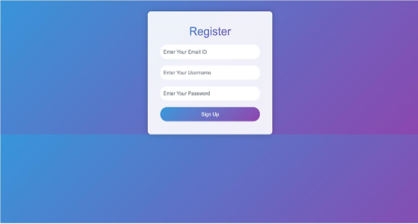
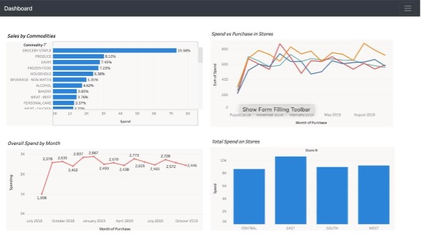
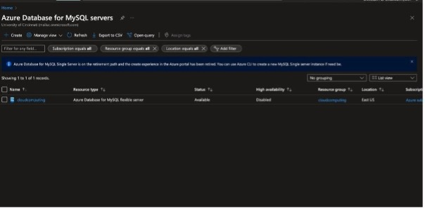
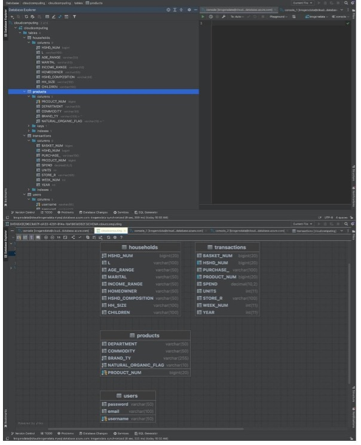

# KrogerApp

  

## Table of Contents
- [Project Overview](#project-overview)
- [Features](#features)
- [Setup Instructions](#setup-instructions)
- [Usage](#usage)
- [Screenshots](#screenshots)
- [Technologies Used](#technologies-used)
- [License](#license)

## Project Overview
KrogerApp is a cloud-based web application designed to enhance the retail shopping experience. Leveraging Azure Cloud and machine learning, this project provides insights into customer behavior and optimizes decision-making processes for retail businesses.

The application integrates anonymized retail data from Kroger to create an interactive platform for data visualization and analysis. It includes features like user registration, data search, and a dashboard for demographic insights.

## Features
- **User Registration and Login**: Secure user authentication.
- **Interactive Dashboard**: Visualize customer engagement and demographic factors.
- **Data Search**: Query and sort retail data by various parameters.
- **Azure Database Integration**: Store and retrieve data efficiently using Azure services.

## Setup Instructions
1. Clone the repository:
   ```bash
   git clone <repository-url>
   ```
2. Navigate to the project directory:
   ```bash
   cd KrogerApp
   ```
3. Install dependencies:
   ```bash
   pip install -r requirements.txt
   ```
4. Run the application:
   ```bash
   python app.py
   ```

## Usage
- Access the application via the local server URL provided after running `app.py`.
- Use the registration page to create an account.
- Explore the dashboard for insights and search functionality for data queries.

## Screenshots
### Registration Page


### Home Page


### Dashboard


### Azure Database


### Database Explorer


## Technologies Used
- **Backend**: Flask (Python)
- **Frontend**: HTML, CSS
- **Database**: Azure SQL, MySQL
- **Cloud Platform**: Microsoft Azure

## License
This project is licensed under the MIT License. See the LICENSE file for details.