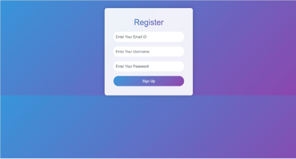
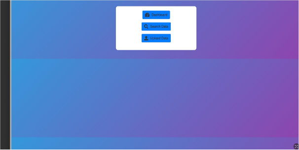

# KrogerApp

## Cloud Computing Final Project

### Project Abstract

As data volume, variety and velocity accelerate, organizations need to leverage modern data engineering. Every industry is being disrupted by data. In healthcare and life sciences, genomic data enable targeted drug discovery and personalized medicine. In financial services, alternative and third-party data provide increasingly vital investment signals.  In retail and consumer packaged goods, demand forecasting, pricing, and inventory data deliver an order of magnitude efficiencies.  Azure and Cloud Computing provide an opportunity to deploy Software application solutions easier, faster, better, and at scale.

Machine learning has gained significant importance in the retail sector owing to its capacity to analyze extensive datasets and derive valuable insights, thereby enhancing decision-making processes and improving customer experiences. Understanding the applications of ML models like linear regression, random forest, and gradient boosting algorithms is vital for accurately forecasting product demand, efficiently managing inventory levels, and optimizing pricing strategies in alignment with market demands.

For the final group project, we will explore real-world Retail data from 84.51°/Kroger (anonymized) to create an interactive Web Application in Azure Cloud.   You will have the ability to focus on innovative problem-solving solutions using the Azure technology stack.  The goal is to work on solutions that will make life easier for a Retail shopper.  Be creative and put yourself into the shopper’s shoes.  Focus on the core principle, "Make the Customer's Life Easier"

### FINAL Group Project Requirements:

Launch / configure Web server in Azure (any platform accepted but should be accessible through the internet). Design an interactive web page to do the following 
Username
Password
Email
Create a datastore or database in Azure of your choice, and load SAMPLE Transactions, Households, and Products data from  the 8451_The_Complete_Journey_2_Sample-1.zip Download 8451_The_Complete_Journey_2_Sample-1.zip(Azure SQL, PostgreSQL, MySQL, Mongo DB, Azure Storage Account, etc.)   Please choose the free (No Cost) or Least cost option where possible in Azure.  Create a display page where we can see Sample Data Pull for HSHD_NUM #10, linking the household, transaction, and products tables.  Sort by Hshd_num, Basket_num, Date, Product_num, Department, Commodity.  Similar to the SAMPLE DATA PULL FOR HH #0001 table shown. (You have an option to join the data sets ( Households,Transactions, Products) beforehand in Anaconda or Databricks before storing the DATA PULL in Azure). (3 points)
Create an interactive web page that will allow us to search on  DATA PULLs based on Hshd_num.  Sort by Hshd_num, Basket_num, Date, Product_num, Department, Commodity.  

Web Page with Dashboard to answer Which demographic factors appear to affect customer engagement? 

### Registration Page

### Home Page 

### Dashboard

### Azure databse

### Database Explorer
